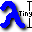
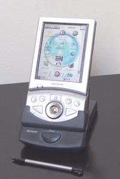
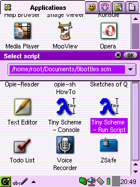
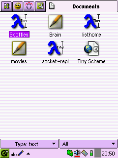
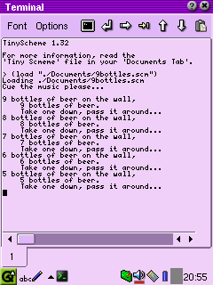
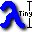
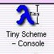
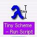
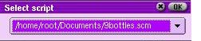

# Tiny Scheme for the Sharp Zaurus - 2002

TinyScheme by Dimitrios Souflis is available for the Sharp Zaurus!

 (source: Wikipedia)

* TinyScheme is free, under a BSD-style license.
* Read the [included documentation](./src/ipk/opt/QtPalmtop/help/.tinyscheme/tinyscheme.html).
* Download the IPK goodness in releases.

### Run Scripts

When selecting the Tiny Scheme - Run Script icon, a popup dialog box finds all of your scheme scripts.  

Select one of them to execute, and it'll run in a terminal similar to the last screenshot.

### Integrated Documents

Scheme scripts are registered MIME-types and display in your Documents Tab.

Select one of them to execute, and it'll run in a terminal similar to the last screenshot.

In addition, the Tiny Scheme documentation icon is displayed. You can also read it here.

Note that these are the ONLY TinsScheme files that will show up in your Documents Tab.

### Console and Read Eval Print Loop (REPL)

This is what you get when you select the Tiny Scheme - Console icon.

Note the example scheme scripts are stored in your ~/Documents directory.

# Included Documentation and Tutorial

# Tiny Scheme

TinyScheme by Dimitrios Souflis is now available for the Sharp Zaurus!

Check out the included resources:

- [Scheme Tutorial](./src/ipk/opt/QtPalmtop/help/.tinyscheme/schemetutorial/schemetutorial/schemetutorial.html)
- [TinyScheme Documentation](./src/ipk/opt/QtPalmtop/help/.tinyscheme/tinyscheme.html)
- [TinyScheme Extension Functions](./src/ipk/opt/QtPalmtop/help/.tinyscheme/tsx-functions.html)

### Features

- The same scheme as seen in Apache 2's mod_scheme!
- Installs to CF!
- Run any script via the "*TinyScheme - Run Script*" icon. [Requires opie-sh](#opiesh)
- Interactive TinyScheme console, with icon.
- ALL features are available including advanced math, ASCII, and strings.
- Advanced [extension functions](./src/ipk/opt/QtPalmtop/help/.tinyscheme/tsx-functions.html) are included.
- '*.scm' files are registered as text MIME-types.
- Run scripts directly by clicking on them in your "Documents Tab," also does not pollute your "Documents Tab" with needless files and pictures.
- Only an 80K executable.
- Includes a great [Scheme Tutorial!](./src/ipk/opt/QtPalmtop/help/.tinyscheme/schemetutorial/schemetutorial.html)

### Requires

- Sharp Zaurus SL-5000 or embedded-konsole, available here: [http://www.rit.edu/~tfs1812/feed/](http://www.rit.edu/~tfs1812/feed/).
- opie-sh suggested, available here: [http://www.rit.edu/~tfs1812/feed/](http://www.rit.edu/~tfs1812/feed/).

### TinyScheme - Console

Selecting this brings up TinyScheme in the terminal (embeddedkonsole or opie-embeddedkonsole). In the interactive terminal you can enter your own commands, trace the script `(tracing 1)`, or load up pre-edited scripts `(load "whatever.scm")`.

### TinyScheme - RunScript

Selecting this icon brings up this dialog:

It lists all "*.scm" scripts in:

- Your home directory: *$HOME*
- CF card: */mnt/cf*
- SD card: */mnt/sd*

Selecting a script from the drop-down will execute it in a terminal.

This feature requires opie-sh, available here: [http://www.rit.edu/~tfs1812/feed/](http://www.rit.edu/~tfs1812/feed/).

### Development Tips

- The example programs displayed in the "Documents Tab" are available for hacking in your "*~/Documents*" directory.
- Typing 'tinyscheme' or 'scheme' in the terminal will bring up TinyScheme.
- You can include a filename too: `# tinyscheme ~/Documents/9bottles.scm`
- The terminal (embeddedkonsole) in the SL-5000 has a working 'delete' key, making interactive programming easier.
- The embeddedkonsole supplied by opie allows multiple terminals in tabs. Open one for editing and another for script execution.

### Bugs

- **Zaurus Bug**: If installed to CF, uninstallation leaves behind some links to the example scripts in your "*~/Documents*" directory. To completely remove, install in RAM, then uninstall.
- **Opie-EmbeddedKonsole Bug**: Backspace appears to be broken. Works okay with the original embeddedkonsole app.
- **TinyScheme Bug**: The internal package system does not appear to be working.
- Sometimes TinyScheme apps automatically run after closing the terminal or editor. Unsure why, but this has been happening on my Zaurus before this project started.
- Clicking on a script in the documents tab doesn't always run it. Just click on it again; I'm looking into it.

### About

- This Zaurus package is compliments of AlphaGeeksInc. [http://www.alphaGeeksInc.com](http://www.alphaGeeksInc.com) Feel free to contact me.
- TinyScheme is maintained by Dimitrios Souflis [http://tinyscheme.sourceforge.net](http://tinyscheme.sourceforge.net)
- TinySchemeExtensions is developed and maintained by Manuel Heras-Gilsanz [http://heras-gilsanz.com/manuel/index.html](http://heras-gilsanz.com/manuel/index.html)
- The Scheme Tutorial used with permission by Catharina Candolin [http://www.niksula.cs.hut.fi/~candolin/scheme/](http://www.niksula.cs.hut.fi/~candolin/scheme/)

### History

- **1.1** 2002-01-10 TinyScheme 1.33 released- CG bug fix.
- **1.0** 2002-11-18 Initial Release
